# Démarrer avec Metabase

Metabase est un outil d'analyse décisionnelle simple et puissant qui laisse qui que ce soit apprendre et prendre des décisions à partir des données de l'organisation. Aucun bagage technique requis! Nous espérons que vous l'adopterez!

## Se connecter

La manière dont vous vous connectez à Metabase dépend de comment vous ou votre administrateur l'a configuré. Si vous ne savez pas où aller, posez simplement la question à la personne qui vous a envoyé une invitation à Metabase.

## La page d'accueil

De base, Metabase vous montrera quelques éléments sur la page de garde:

- Quelques [explorations automatiques](./users-guide/14-x-rays.md) (radiographies) de vos tables, que vous pouvez observer et sauvegarder sur votre tableau de bord si certaines vous plaîsent.
- Une zone où les choses que vous ou vos collègue avez créées apparaîtront, en parallèle avec un lien pour retrouver tous les tableaux de bord, questions et pulses que vous avez.
- Une liste de bases de données que vous avez connecté à Metabase.

## Poser une question

Assez parlé de ça, créons des questions! Pour les quelques exemples suivants, nous utiliserons un **échantillon de données** qui vient avec Metabase.

Vous pouvez cliquer sur **Poser une question** dans la partie supérieure de l'écran. Il y a plusieurs manières de poser des questions dans Metabase, mais nous cliquerons simplement sur **Question simple** pour l'instant. Ensuite, vous devrez sélectionner la table par rapport à laquelle vous avez une question. Cliquez sur la base de données dans laquelle se trouve cette table, puis sélectionnez la table dans la liste. Une fois que ce sera fait, vous verrez les contenus de la table.

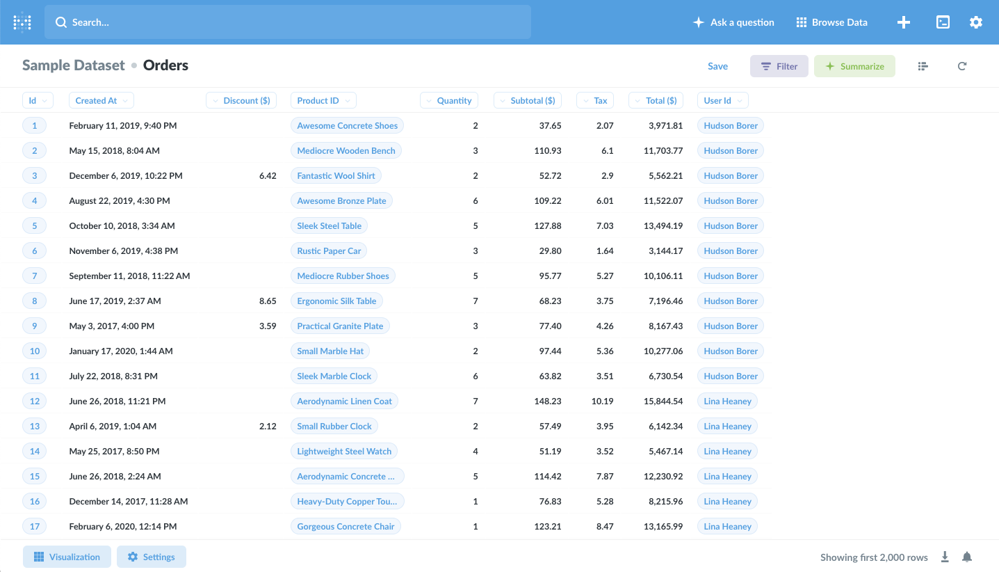

## Notre première question

La table de commandes (orders) contient une série de fausses données à propos de commandes de produits pour une entreprise imaginaire. Démarrons en posant une simplem question par rapport à ces commandes: combien de commandes ont été placées avec un sous-total (avant taxes) supérieur à \$40? Ou plus précisément, cette questions se tratuit comme "Combien d'enregistrements (de lignes) se trouvent dans la table Commandes (orders) avec une valeur plus grande que 40 dans la colonne sous-total?

Afin de le découvrir, nous souhaitons _filtrer_ les données par **le champ par lequel nous sommes intéressés**, ce qui est "Sous-total". Comme chaque ligne de cette table représente une commande, compter la quantité de lignes qui reste après avoir appliqué notre filtre devrait nous donner la réponse que nous cherchons.

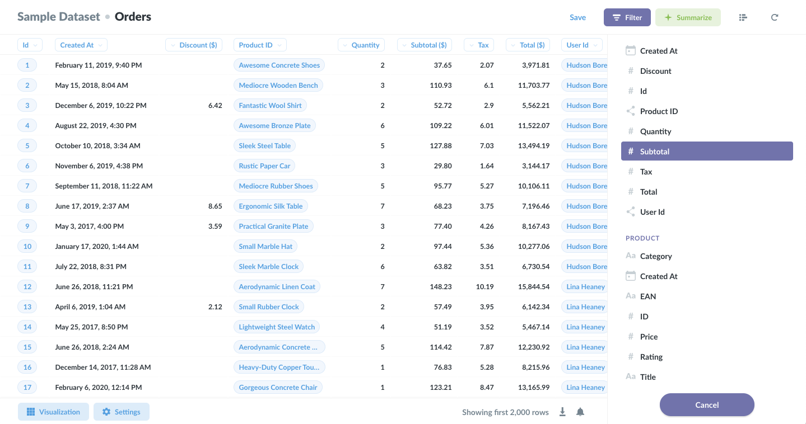

Donc, nous cliquons sur le bouton "Filtre" pour ouvrir la barre latérale de filtrage, puis sélectionnons "Sous-total" comme la colonne sur laquelle nous voulons filrer, et nous obtiendrons quelques options de filtre. Choisissons **Plus grand que**, tapons le nombre 40 dans la case, et cliquons sur "Ajouter un filtre".

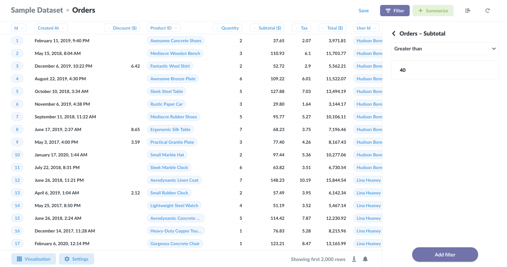

Maintenant il nous faut dire à Metabase quel nombre nous voulons voir. Quand nous demandons des choses comme "combien de..." ou "quel est le total" ou "quelle est la moyenne", etc, nous avons besoin de **résumer** nos données. Nous cliquerons donc sur le bouton Résumer pour ouvrir la barre latérale où nous pourrons sélectionner comment nous souhaitons résumer ces données. La métrique "Nombre de lignes" est sélectionnée par défaut, ce qui est très bien parce que nous voulons justement compter le nombre total de lignes qui correspondent à notre filtre.

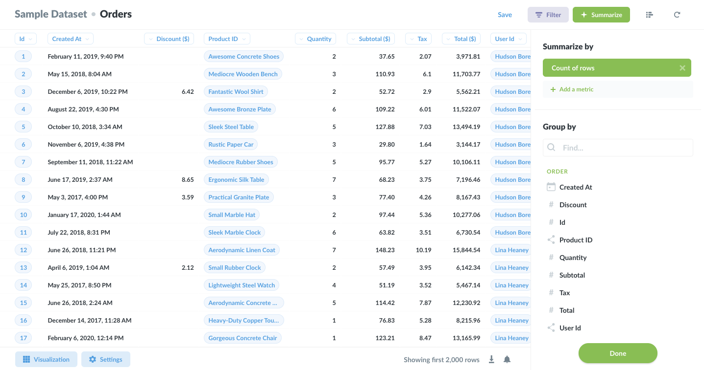

### Et notre première réponse!

OK, cool — nous sommes prêts à poser notre question. Cliquons sur **Fait**!

On dirait que nous avons 16309 commandes, chacune avec un sous-total supérieur à \$40. Bien. Une autre façon de dire ça c'est que nous avons 16309 _enregistrements_ dans la table, qui correspondent aux paramètres que nous avons configuré.

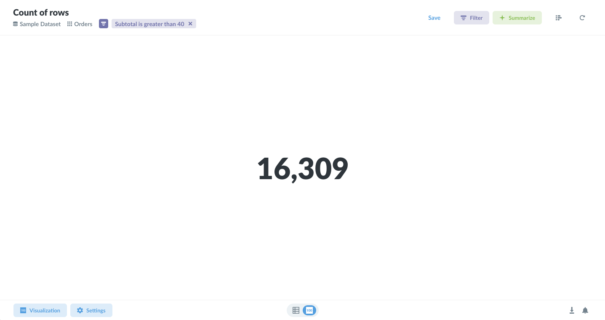

### Modifier la question

OK, c'est fort utile, mais ce serait encore _plus_ utile si nous savions durant _quels mois_ nos clients ont placé ces grosses commandes. Et ce n'est pas compliqué non plus.

Si nous ouvrons le panneau Résumé à nouveau, sous l'endroit où nous avons sélectionné la métrique, il y a une liste de toutes les colonnes que nous pouvons utiliser pour **regrouper**. Celle que nous voulons, c'est **Created At** ("Créée le"), parce que cela nous donnera maintenant un nombre total de commandes au-delà de \$40 pour chaque mois pendant lequel ces commandes on été passées (ou "créées le"). Nous sélectionnerons donc **Created At** et Metabase nous montre immédiatement un graphique de type lignes des commandes au fil du temps.

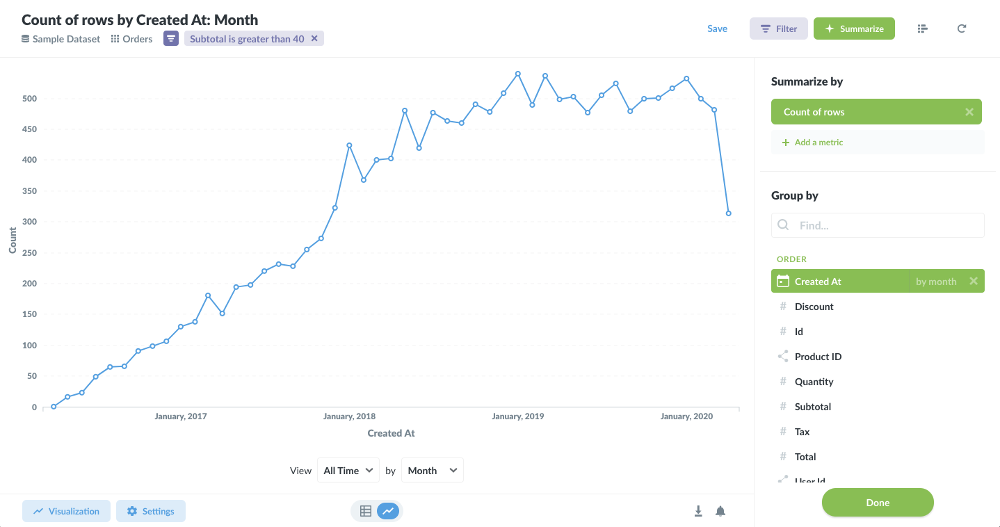

Si nous souhaitons vérifier rapidement les résultats sous forme de tableau, nous pouvons cliquer sur l'icône de transition au milieu en bas de la page, pour passer de notre graphique aux données brutes, et inversément.

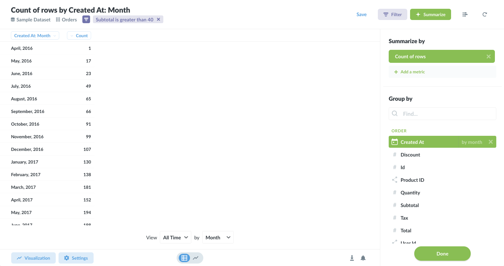

### Changer de visualisation

Metabase peut présenter les réponses à vos questions dans une variété de manières. Pour changer la visualisation, sélectionnez simplement l'une des options depuis le panneau latéral **Visualisation**. Cliquez sur le bouton _Visualisation_ en bas à gauche de la page pour l'ouvrir. Sélectionnons le graphique de type **Surface**.

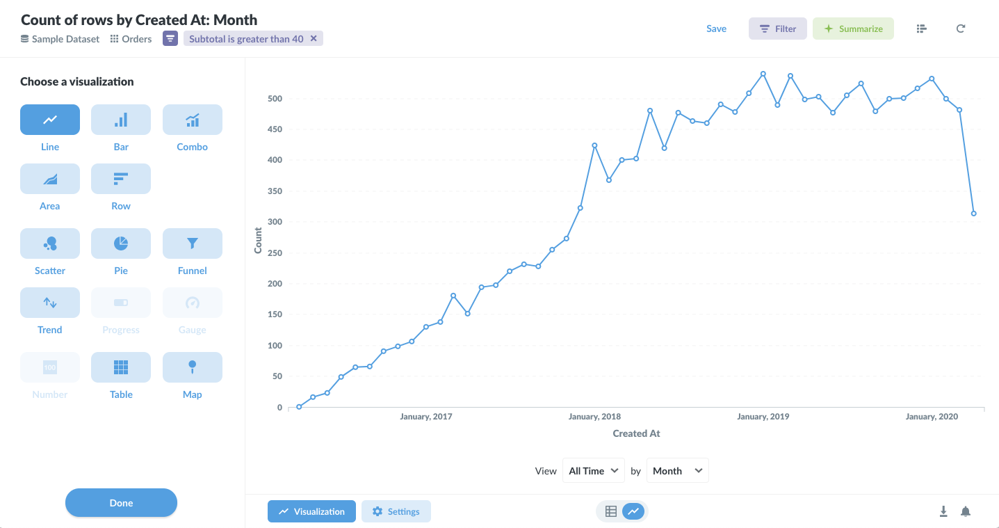

Chouette! Il semblerait que les affaires vont bien - vers la droite et vers le haut est toujours un bon signe.

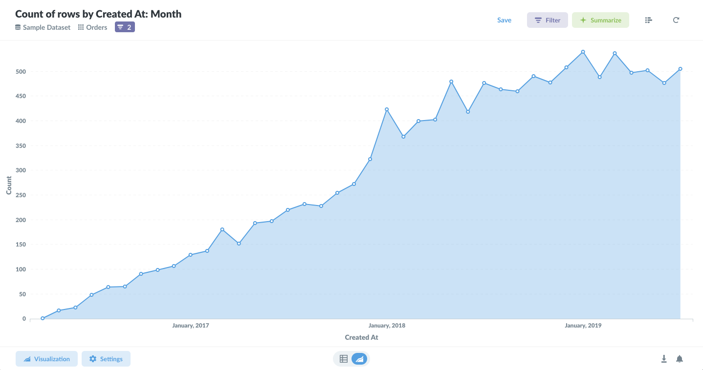

Vous observerez que certaines visualisations ne sont pas les meilleures pour montrer une réponse à une question. Si Metabase pense que c'est le cas pour un type de visualisation spécifique combiné à votre réponse, ce choix de visualisation apparaîtra grisé dans le panneau latéral. Par exemple, cela n'aurait pas de sens de montrer le nombre total de commandes au-dessus de \$40 comme un graphique de type _barre de progression_ ou _carte_.

Si vous le souhaitez, vous pouvez jouer un peu avec votre question, comme modifier le nombre 40 pour un nombre différent. Pour cela, cliquez simplement sur l'étiquette du filtre correspondant sous le titre de la page.

## Partager les réponses avec d'autres

Vous pouvez utiliser Metabase par vous-même, mais cela devient vraiment plus puissant lorsque vous commencez à partager vos questions avec d'autres personne de votre équipe ou de votre organisation. La première étape est de sauvegarder quelques unes de vos questions.

### Sauvegarder les questions

Parfois, vous vous rendrez compte que vous posez les mêmes questions de plus en plus souvent, que ce soit pour générer des rapports réguliers, pour chercher une donnée particulière par rapport à un segment d'utilisateurs, ou simplement pour répondre à la même question pour des personnes différentes au sein de votre organisation. Pour éviter de répéter les mêmes étapes à chaque fois que vous voulez poser la même question, vous pouvez sauver vos questions pour les réutiliser plus tard.

Pour cela, cliquez sur le bouton **Sauvegader** en haut à droite de la page de l'éditeur de questions.

Metabase essaiera de donner un nom sémantiquement intéressant, mais vous pouvez (et devriez) utiliser votre propre convention de nommage pour vous aider vous et aider les autres à retrouver vos questions plus tard, une fois que l'amnésie vous aura atteint. Vous pouvez également choisir un répertoire, ou _Collection_, pour y sauvegarder votre question.

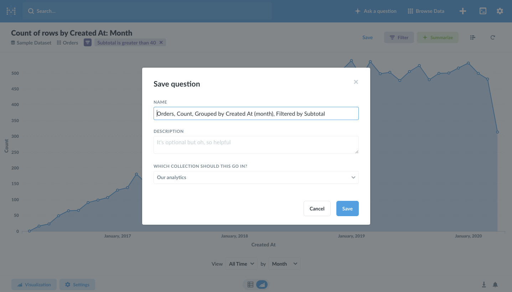

Une fois que vous avez sauvegardé votre question, Metabase vous demandera si vous voulez l'ajouter à un _Tableau de bord_ existant. Cliquons sur **Créer un nouveau tableau de bord** pour essayer cette option. Vous verrez une fenêtre de dialogue qui vous demande d'en créer un nouveau et de lui donner un nom et une description. Donnez-lui le nom que vous voulez. Nous appellerons le nôtre "My First Dashboard".

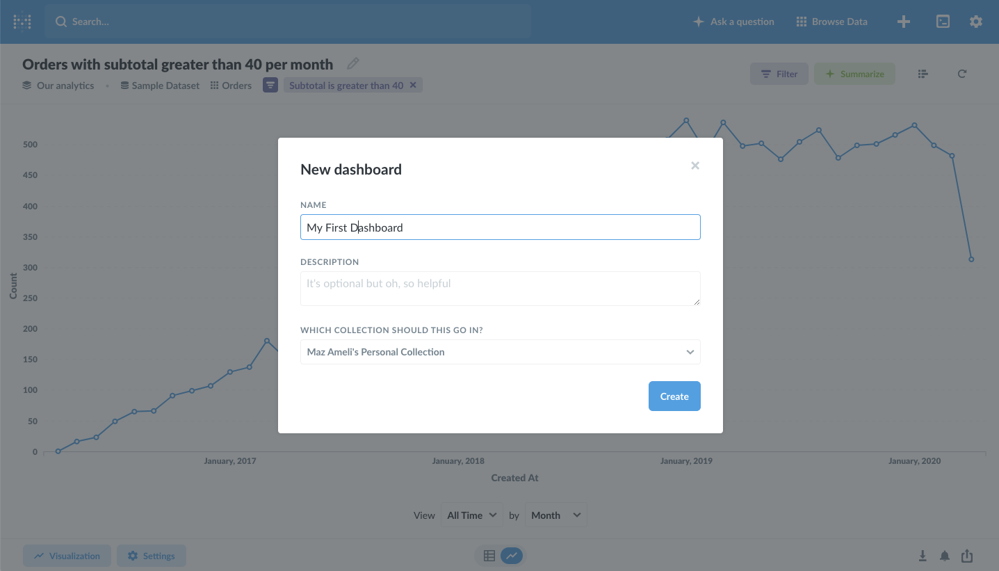

### Créer un tableau de bord

Les tableaux de bord sont utiles quand vous avez un groupe de réponses que vous voulez visualiser ensemble. Vos questions sauvegardées seront affichées comme des cartes sur le tableau de bord, que vous pourrez ensuite redimensionner et bouger à souhait.

Et donc, après avoir cliqué sur le bouton pour créer votre tableau de bord, vous devriez voir votre graphique comme une petite carte.

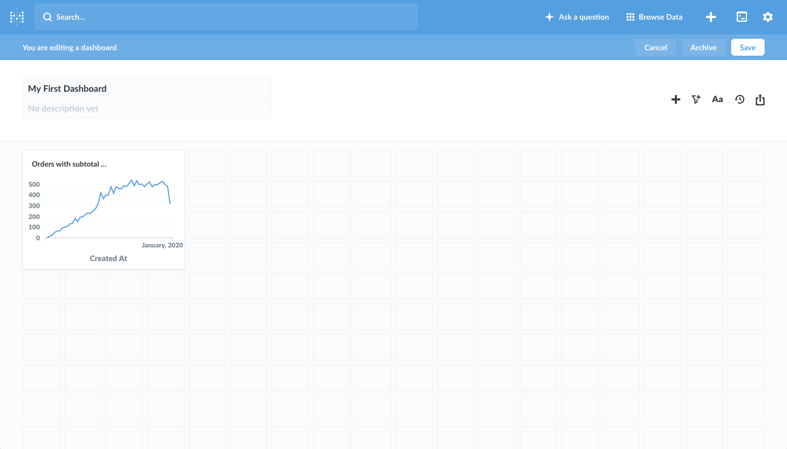

Vous pouvez bouger et redimensionner vos graphiques afin d'obtenir l'apparence exacte que vous souhaitez. Cliquez simplement sur _Sauvegarder_ en haut à droite une fois que c'est bon. Nous rendrons le notre un peu plus large pour donner de l'espace pour respirer à nos quelques points.

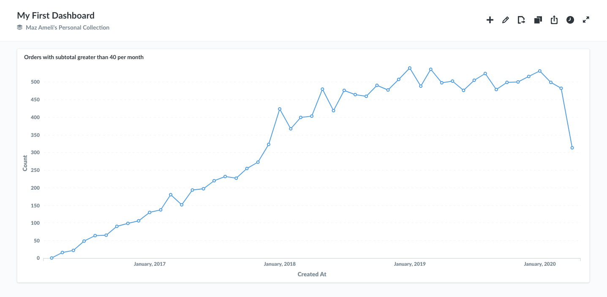

### Partager des réponses directement

Autre chose: une fois que vous avez posé une question et que vous l'avez sauvée sur un tableau de bord, l'URL de votre navigateur vous donnera le lien direct vers cette question ou ce tableau de bord. Ça veut dire que vous pouvez copier et coller cette URL dans un e-mail ou un 'tchat et laisser d'autres personnes voir vos graphiques. Cela ne fonctionnera cependant que si Metabase a été installé sur un serveur partagé, et exigera la création de comptes Metabase pour les personnes avec qui vous souhaitez les partager.

---

## C'est tout!

Nous espérons que ce petit guide vous aura été utile. Vous voulez en savoir plus? Votre soif de connaissance est insatiable? Visitez notre [Guide utilisateur](users-guide/start.md) pour des explications plus en profondeur sur les tenants et aboutissants de Metabase.
