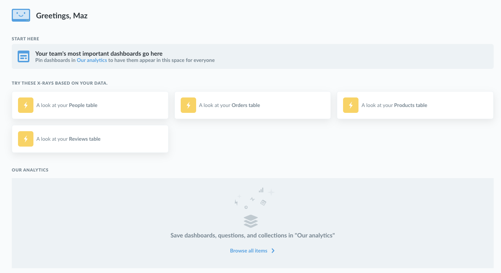
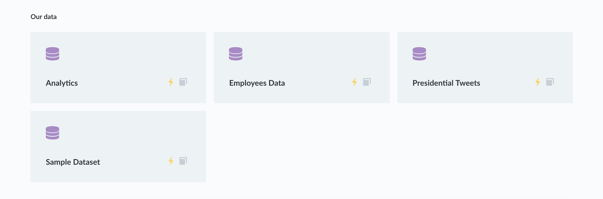
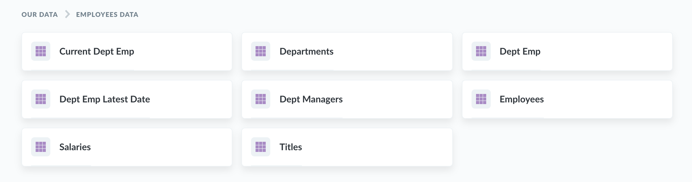
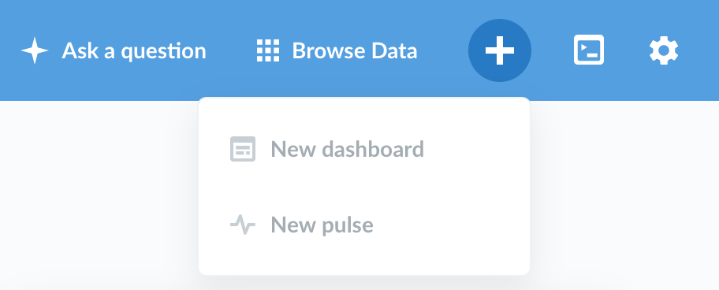
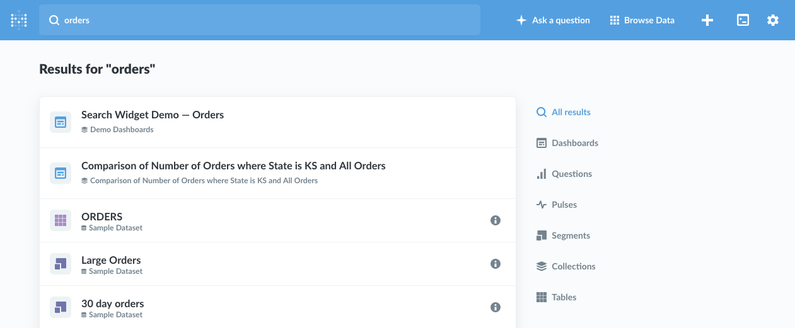

## Qu'est-ce que Metabase?

Metabase est un outil Open Source de Business Intelligence. Il vous permet de poser des questions au sujet de vos données, et affiche des réponses dans des formats qui ont du sens, que ce soit un graphique à barres ou un tableau détaillé.

Vos questions peuvent être sauvegardées pour plus tard, ce qui rends vos opérations plus simples quand vous y revenez, ou vous pouvez grouper vos questions sur des tableaux de bords visuellement attractifs. Metabase simplifie également le partage de vos questions et tableaux de bord avec le reste de votre équipe.

## Trouver votre chemin

Vous avez un [Metabase fonctionnel](../operations-guide/start.md) et [connecté à vos données](../administration-guide/01-managing-databases.md). Il est temps de vous introduire à l'interface.

### La page d'accueil

Dès le début, Metabase vous montre quelques petites choses intéressantes sur la page d'accueil :

- Quelques [analyses automatiques](14-x-rays.md) de vos tables, que vous pourrez vérifier et sauvegarder comme éléments de votre tableau de bord si elles vous sembles utiles (les administrateurs peuvent cacher cette section en permanence en cliquant sur la croix `X` qui apparaît quand vous la survolez).
- Une zone où les choses que vos collègues ont créé apparaîtront, ainsi qu'un lien pour voir tous les tableaux de bord, questions et pulses que vous avez.
- Une liste des bases de données que vous avez connecté à Metabase (comme pour les radiographies, les administrateurs peuvent cacher cette section en permanence en cliquant sur le `X` qui apparaît lors du survol. Vous pouvez cliquer sur "Parcourir les données" depuis la barre de navigation principale pour voir vos bases de données et tables).

Une fois que vous aurez créé quelques [tableaux de bord](07-dashboards.md), n'importe lequel d'entre eux que vous épingliez dans la collection "Notre décisionnel" apparaîtra pour tous vos collègues, comme ça dès qu'ils se connecteront à Metabase, ils sauront où aller.

### Parcouris les données

Si vous avez connecté votre base de données à Metabase durant la configuration, vous la verrez listée en bas de la page d'accueil, avec le set de données d'exemple avec lequel Metabase est fourni.
Cliquez sur une bases de données pour voir son contenu. Vous pouvez cliquer sur une table pour voir ses lignes, ou vous pouvez cliquer sur l'icône d'éclair pour radiographier une table et voir une analyse automatique de celle-ci, ou encore cliquer sur l'icône de livre pour aller dans la vue de référence des données pour cette table pour en apprendre plus à son sujet.

### Explorer vos analyses

Tandis que vous et votre équipe créez des tableaux de bord et des collections, ceux-ci apparaîtront progressivement sur la page d'accueil. Cliquez sur une collection dans las section "Notre décisionnel" pour voir son contenu, ou cliquez sur "Parcourir tous les éléments" pour voir tout ce que vous et votre équipe avez fait [plus de détails](03-basic-exploration.md)

### Poser une question ou écrire une requête native

Cliquez sur le bouton `Poser une question` en haut à droite de Metabase pour démarrer une exploraion simple de l'une de vos tables, poser une question personnalisée plus détaillée avec l'éditeur de questions ou écrire une requête SQL si vous souhaitez réellement aller plus loin.

### Créer un tableau de bord ou un pulse

Dans Metabase, les tableaux de bords sont constitués de questions sauvegardées que vous avez arrangé et redimensionné selon vos besoins. Ils représentent une super manière de suivre les métriques et les statistiques importantes pour vous. Les pulses sont le nom donné aux rapports programmés périodiques dans Metabase. Ils peuvent être envoyés par e-mail, via Slack, ou les deux.

Pour créer un tableau de bord ou un pulse, cliquez sur l'icône plug (+) dans la partie supérieure droite de la barre de navigation principale.

### Utiliser la recherche pour trouver des choses rapidement

La barre de recherche qui est toujours présente au sommet de l'écran vous permet de chercher entre les tables, les tableaux de bord, les collections, les questions sauvegardées, les métriques, les segments et les pulses en un instant. Tapez simplement une partie du titre de ce que vous cherchez et taper entrée. Vous pouvez activer la barre de recherche depuis n'importe où en pressant simplement la touche `/`.

## Effleurer les bases de données

Pour pleinement comprendre comment utiliser Metabase, il est utile d'avoir au moins une compréhension de haut-niveau des bases de données. Nous discuterons donc des [bases des bases de données](02-database-basics.md) dans le prochain chapitre.
