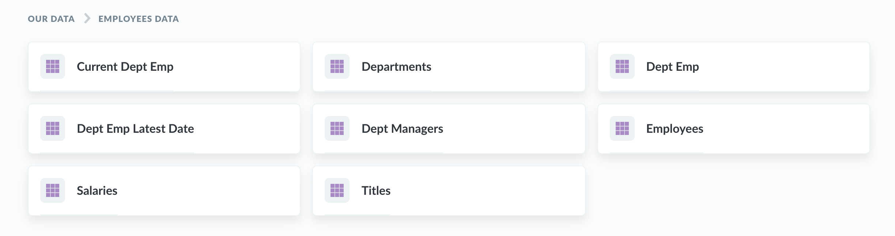

## L'exploration dans Metabase

#### Voir ce que vos collègues ont fait

Tant que vous n'êtes pas le premier utilisateur dans votre équipe Metabase, la façon la plus simple de commencer à explorer vos données est de jeter un oeil aux tableaux de bord, aux graphiques et aux listes que vos collègues ont déjà créé. Le meilleur endroit poyur commencer est de regarder les tableaux de bord qui pourraient avoir été attachés à votre page d'accueil ou dans les collections auxquelles vous avez accès.

#### Explorer vos données

Alternativement, vous pouvez plonger directement dans les données dans Metabase en cliquant sur l'une des bases de données en bas de page ou en cliquant sur "Explorer les données" en haut à droite, et en sélectionnant une base de données puis l'une de ses tables pour les voir. Vous pouvez également cliquer sur l'icône d'éclair sur n'importe quelle table pour visualiser une exploration automatique de ses données. Essayez-le!

#### Explorer les collections

Les collections dans Metabase sont très similaires à des répertoires. C'est là que vous retrouverez tous les graphiques et tableaux de bord de vos collègues. Pour explorer une collection, cliquez sur la section "Notre décisionnel" sur la page d'accueil, ou cliquez sur `Explorer tous les élements` pour tout voir.

Si vos collègues sont cool, ils auront épinglé certains tableaux de bord ou questions importants dans vos collections; si c'est le cas, ces éléments importants ou utiles apparaîtront en grand dans la partie supérieure d'une collection. Les tableaux de bord qui ont été épinglés dans la collection "Notre décisionnel" apparaîtront aussi sur la page d'accueil de Metabase.

Les collections ont aussi une liste de tous les autres éléments qui y ont été sauvés, ainsi qu'une liste d'autres colletions qui ont été sauvées au sein de l'actuelle.

#### Exploration des tableaux de bord

Les tableaux de bord sont simplement des ensembles de graphiques et de nombres auxquels vous voudriez pouvoir vous référer plus tard régulièrement. [En savoir plus sur les tableaux de bord](07-dashboards.md).

Si vous cliquez sur une partie d'un graphique, comme une barre dans un histogramme, ou un point sur un graphique à lignes, vous verrez un menu contextuel avec des actions que vous pouvez prendre pour explorer plus en profondeur au sein de ce résultat, pour dévier dans une autre direction ou pour le [radiographier](14-x-rays.md) pour obtenir une exploration automatique des choses sur lesquelles vous avez cliqué.

Dans cet exemple de commandes de tartes par type au fil du temps, cliquer sur un point du graphique à lignes nous donne la possibilité de :

- **Zoomer** — c.à.d. de voir seulement les tartes aux fraises en juin 2017
- **Voir ces commandes** — qui vous donne une liste des commandes de tartes aux fraises en juin 2017
- Diviser par **Catégories** — vous permet de voir, par exemple, les commandes de juin 2017 divisées par statut du client (ex. `nouveau` ou `VIP`, etc.) ou d'autres aspects de la commande. Différents graphiques auront différentes possibilités de division, comme le lieu ou l'heure.

**Notez que les graphiques créés avec SQL ne permettent actuellement pas ces options d'action.**

D'autres graphiques ainsi que des cellules de tables vous permettront souvent également d'aller à une vue filtrée de ce graphique ou de cette table. Par exemple, vous pouvez cliquer sur l'un des symboles d'inégalité pour voir le graphique pour les lignes dont la colonne `sous-total` est inférieure à \$100, ou où le marqueur de temps `date_achat` est plus grand que le 1er avril 2017.

Finalement, cliquer sur l'ID d'un élément dans la table vous donnera l'option d'aller à une vue détaillée pour cet enregistrement en particulier.

#### Exploration des questions sauvegardées

Dans le dialecte de Metabase, chaque graphique sur un tableau de bord est appelé une "question". En cliquant sur le titre d'une question dans un tableau de bord, vous pouvez voir les détails de cette question. Vous arriverez également sur cette vue en utilisant les options d'action mentionnées ci-dessus.

Quand vous êtes face à la vue détaillée d'une question, vous pouvez utiliser les mêmes options d'action. Vous pouvez aussi cliquer sur les en-têtes des tables pour voir plus d'options, comme faire la somme des valeurs de la colonne ou filtrer sur base de cette colonne.

L'une de nos options d'exploration préférées est l'option de _Distribution_. Elle vous montrera combien de lignes il y a dans un table, groupées par la colonne sur laquelle vous avez cliqué. Donc si vous avez une table d'utilisateurs, si vous cliquez sur le titre de la colonne _Age_ et choisissez l'option _Distribution_, vous verrez un histogramme avec la quantité d'utilisateurs que vous avez au sein de chaque éventail d'âges.

---

## Suivant : Poser des questions personnalisées

Que faire si vous ne pouvez trouver un tableau de bord ou une question qui fait exactement ce que vous recherchez? Apprenez-en plus sur la façon de [poser nos propres nouvelles questions](04-asking-questions.md)
